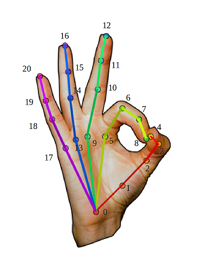

# Hand-keypoints-detection
● Here I have implemented Hand Keypoints Detection whose values can be trained for Better Gesture recognition. 
● I have implemented this project on Python3.6  
● Here apart from the requirements in requirements.txt you have to install Pytorch version==1.2.0 , Torchvision==0.4.0, Opencv-4.1.2  
● The keypoints are diagramatically represented below  
● Download the models file from the given link and place them in the models folder -- https://drive.google.com/open?id=1t_xmu4FIEcXu9xxXII31lDof0H5qtXvj  
 

